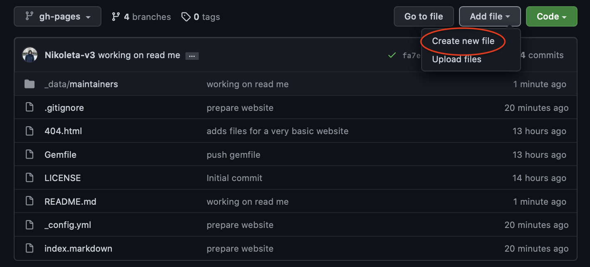
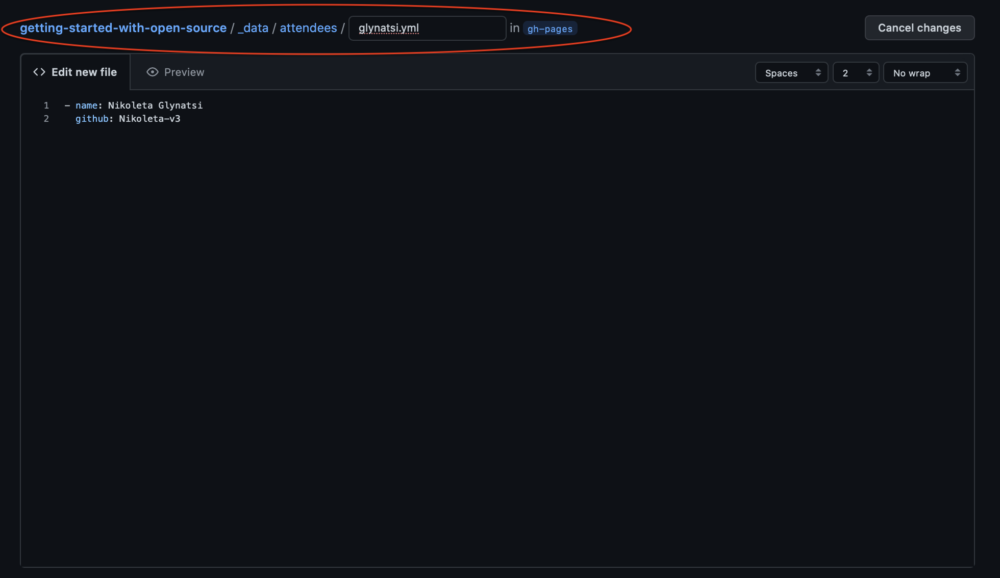
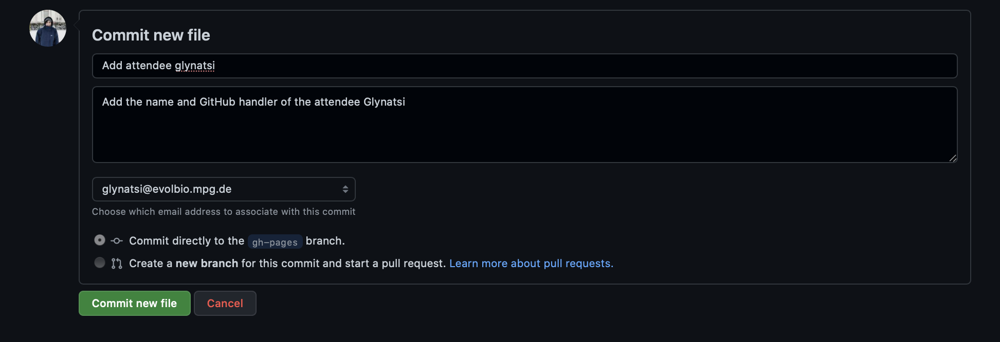
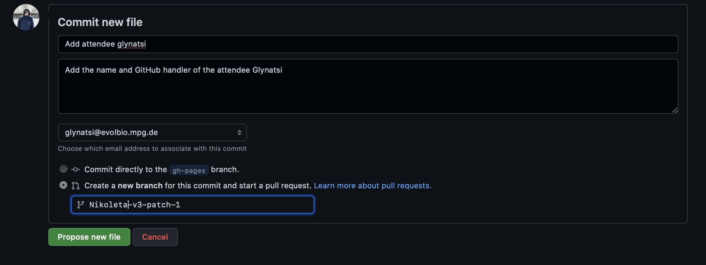
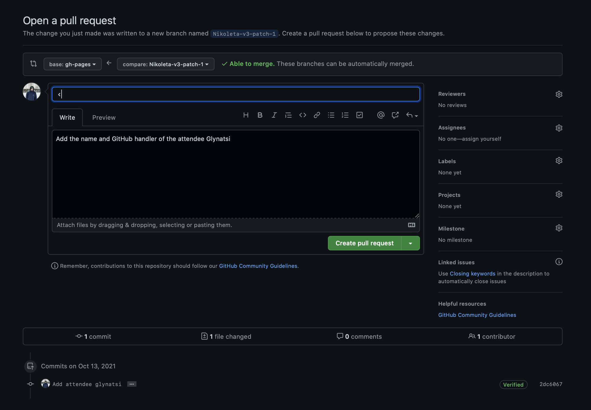
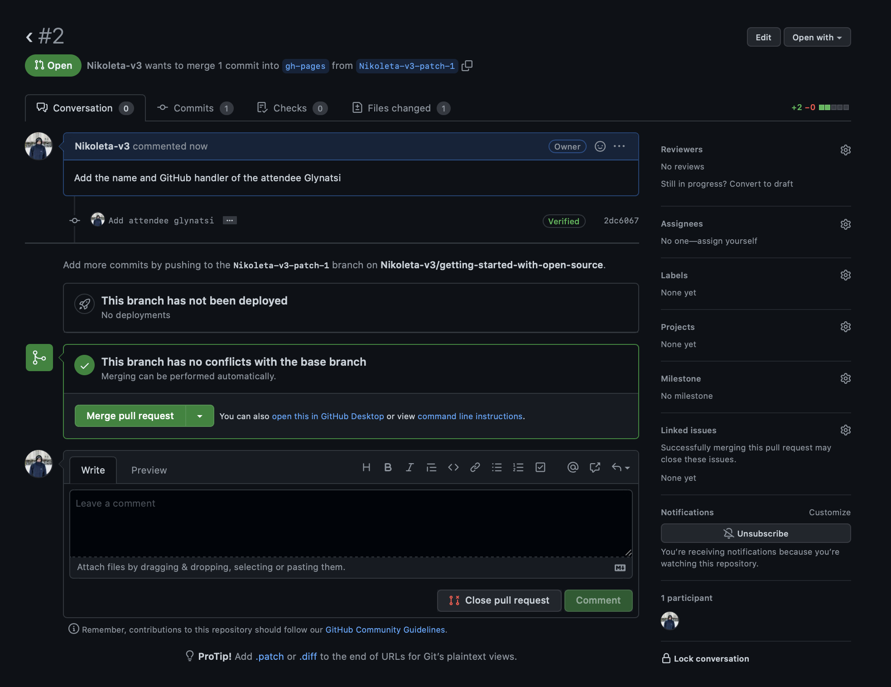

# How To add attendee name using GitHub UI

To add our name to the list of attendees we need to create a new `.yml` file in
the folder `_data/attendees/`. In this tutorial we will see how we can do this
on GitHub.

First we need to go to the main page of the repository:
https://github.com/Nikoleta-v3/getting-started-with-open-source.

On the right side we need to click on the button `Add file` and then `Create new file`.



When we do this we are forward to a new page which looks like:



Here we need to give the name and location of your new file. Remember we want the file to be in the folder `_data/attendees/`. Then we just need a name for our `.yml` name. How about using your last name(s)?

In the file we will to include our name and we will also include our GitHub handler in case people want to collaborate with us in the future! Under `Edit new file` add the following lines:

```shell
- name: Name Surname
    github: handler
```

where you change `Name`, `Surname` and `handler`.

Once we have added the necessary information for our file it's time to `commit` it. Scroll down and there you will see a panel that looks like this:



A commit message is made up of 2 main components:

```shell
<Title of the commit>

<Description of what was done>
```

- The title should be a description in the form of "if this commit is applied
  `title of the commit` will happen". The convention is for this to be rather
  short and to the point.
- The description can be as long as needed and should be a helpful explanation
  of what is happening.

Once we have written our commit message we need to click on `create a new branch`.



and click on `Propose new file`. We are again forwarded to a new page. Here we can have one final check before we open our pull request. Note that pull requests should have meaningful titles. How about you come up with something better than `<`?



One you are done click on `Create pull request`.



Congratulations! You have successfully open a pull request.